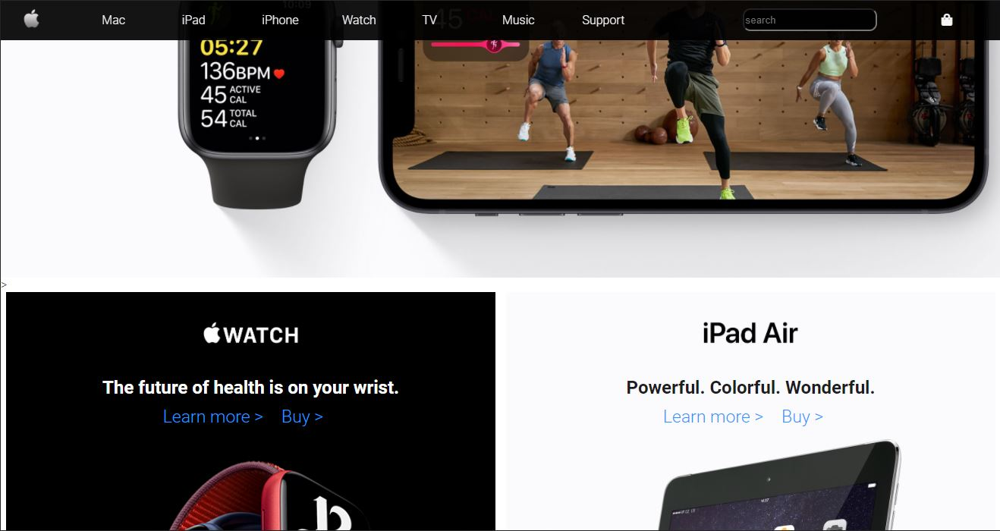

## 🍎— Responsive Apple Website Clone using only HTML & CSS.
This project is a clone of the latest Apple website, created using HTML ,CSS and JavaScript only. The purpose of this project is to practice front-end web development skills, including HTML and CSS layout, responsive design, and web accessibility.

## Demo : https://iamrajank.github.io/Apple-clone-website/
View the website:

## Features
- Fully responsive design, optimized for desktop, tablet, and mobile devices.
- Accurate recreation of the latest Apple website design, including layout, typography, and color scheme.
- Semantic HTML markup and CSS styling, optimized for web accessibility.

### To be declared "PASS", your Webpage must have 4 of this components:

- Header ✔
- Main ✔
- Body ✔
- Footer ✔

